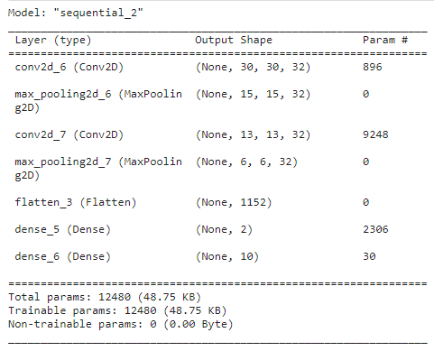

# Module №3 | Активное обучение
## Данные
Активное обучение проводилось на датасете CIFAR10. Данные были разделены на train, val, test выборки.
- train - обучающая выборка
- val - выборка неразмеченных данных
- test - тестовая выборка

## Модель
Используется самописная нейронная сеть для задачи классификации.
</img>

## Активное обучение
В качестве стратегии выбора данных для разметки используется Uncertainty Sampling: выбираются примеры, для которых модель наиболее неуверенна в своем предсказании.

## Итог
На практике было применино активное обучение.
По результату обучения точность модели выросла на тестовой выборке с 0.36 до 0.44 при доразметке по 15 примеров на двух итерациях.