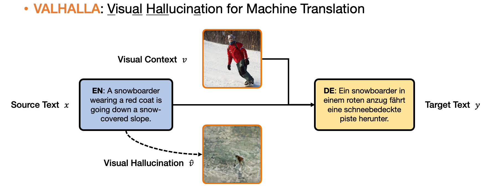
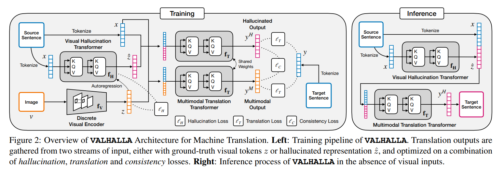
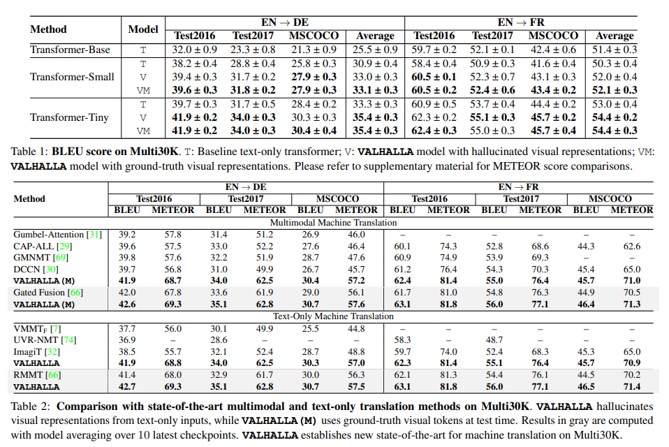
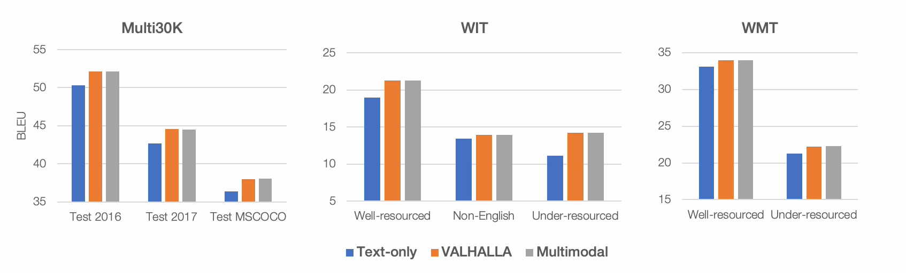

# VALHALLA: Visual Hallucination for Machine Translation

**Ключевые слова:** машинный перевод, обработка естественного языка, генерация изображений, мультимодальные системы, синтетические изображения

***********************

В качестве примера применения синтетических данных мной выбрана статья "VALHALLA: Visual Hallucination for Machine Translation". 
Статья была опубликована 31 мая 2022 года, в которой авторы предлагают новое решение к машинному переводу с применением синтетических данных.

**Идея** \
Мультимодальный подход машинного перевода не является новым. В данной статье предлагается обучение машинному переводу по подобию работы человеческого мозга и ассоциативной памяти. Модель по входному тексту генерирует изображение, которое затем вместе с исходным текстом используется для перевода на другой язык. Как утверждают авторы, особенность их решения в синтезе ассоциативных изображений по входному тексту.

**Архитектура модели**

Общая структура VALHALLA проиллюстрирована на рисунке 2. Архитектура состоит из трех модулей нейронной сети: 
- дискретного визуального энкодера $f_V$ для преобразования входных изображений в вектор;
- авторегрессионного трансформера галлюцинаций $f_H$, который предсказывает визуальные представления из исходного предложения; 
- мультимодального трансформера перевода $f_T$, который предсказывает целевое предложение из объединенной последовательности текстовых и визуальных векторов.

Авторы реализуют векторное квантование с помощью модели VQGAN VAE, используя визуальный энкодер $f_V$ для отображения входного изображения v в последовательность токенов.

**Результаты** \
Для экспериментов используются три стандартные наборы данных MT (Multi30K, WIT и WMT). Проведены эксперименты с различными размерами моделей трансформаторов (Base, Small и Tiny). В экспериментах с Multi30K используются конфигурации Small и Tiny, поскольку было показано, что модели меньшего размера лучше работают с этим набором данных. В задачах WIT и WMT используется базовая конфигурация для задач с хорошими ресурсами, в то время как небольшая конфигурация используется
как для задач с недостаточными ресурсами, так и для задач, не связанных с английским языком. 

VALHALLA обеспечивает улучшение в среднем на 2~3 BLEU по сравнению с базовым уровнем перевода только текста, при этом неизменно превосходя наиболее актуальные современные методы MMT, использующие непрерывное представление изображений. 

Ниже представлены результаты эксперимента сравнения SOTA-решений задачи MT и VALHALLA на датасете Multi30K.

Ниже представлены гистограммы, полученные в результате экспериментов сравнения text-only и мультимодальных решений с VALHALLA на всех трех датасетах.

Команда показала, что их метод обеспечивает более точные переводы, чем модель, обученная только на тексте. Он также может обрабатывать более длинные предложения, языки с ограниченными ресурсами и предложения с пропущенными словами.

**Статья:** [VALHALLA: Visual Hallucination for Machine Translation](http://www.svcl.ucsd.edu/publications/conference/2022/valhalla/main.pdf). Yi Li,Rameswar Panda, Yoon Kim, Chun-Fu (Richard) Chen, Rogerio Feris, David Cox, Nuno Vasconcelos. UC San Diego, MIT-IBM Watson AI Lab, MIT CSAIL. \
**Веб-сайт:** http://www.svcl.ucsd.edu/projects/valhalla/ \
**GitHub:** https://github.com/JerryYLi/valhalla-nmt
